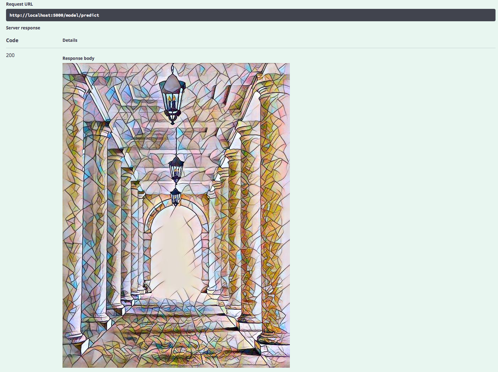
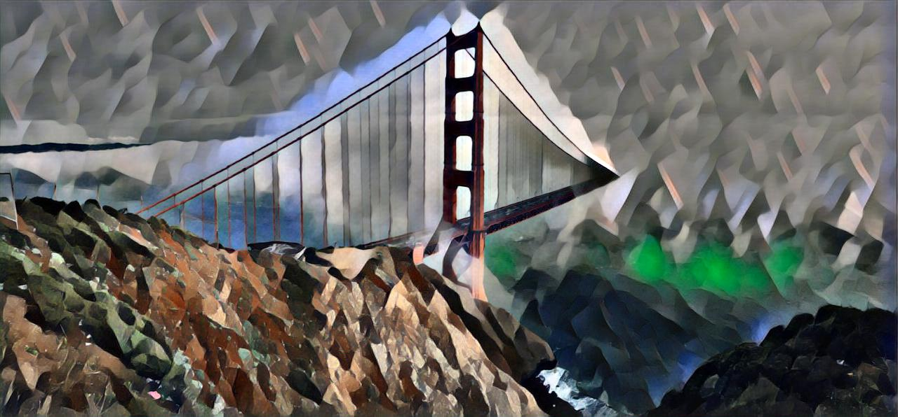

# IBM Code Model Asset Exchange: Fast Neural Style Transfer

This repository contains code to instantiate and deploy an image style transfer model. This model generates a new image that mixes the content of an input image with the style of another image. The model consists of a deep feed-forward convolutional net using a ResNet architecture, trained with a perceptual loss function between a dataset of content images and a given style image. The model was trained on the [COCO 2014](http://mscoco.org/dataset/#download) data set and 4 different style images. The input to the model is an image, and the output is a stylized image.

The model is based on the [Pytorch Fast Neural Style Transfer Example](https://github.com/pytorch/examples/tree/master/fast_neural_style). The model files are hosted on [IBM Cloud Object Storage](http://max-assets.s3-api.us-geo.objectstorage.softlayer.net/pytorch/neuralstyle/neuralstyle.tar.gz). The code in this repository deploys the model as a web service in a Docker container. This repository was developed as part of the [IBM Code Model Asset Exchange](https://developer.ibm.com/code/exchanges/models/).

## Model Metadata
| Domain | Application | Industry  | Framework | Training Data | Input Data Format |
| ------------- | --------  | -------- | --------- | --------- | -------------- | 
| Vision | Style Transfer | General | Pytorch | [COCO 2014](http://mscoco.org/dataset/#download) | Image (PNG/JPG/TIFF)|

## References

* _J. Johnson, A. Alahi, L. Fei-Fei_, ["Perceptual Losses for Real-Time Style Transfer and Super-Resolution"](https://arxiv.org/pdf/1603.08155.pdf), 2016
* _D. Ulyanov, A. Vedaldi, V. Lempitsky_, ["Instance Normalization"](https://arxiv.org/pdf/1607.08022.pdf), 2017
* _D. Ulyanov, A. Vedaldi, V. Lempitsky_, ["Improved Texture Networks: Maximizing Quality and Diversity in Feed-forward Stylization and Texture Synthesis"](https://arxiv.org/pdf/1701.02096.pdf), 2017
* [Pytorch Tutorial](http://pytorch.org/tutorials/advanced/neural_style_tutorial.html)
* [Pytorch Fast Neural Style Transfer Example](https://github.com/pytorch/examples/tree/master/fast_neural_style)

## Licenses

| Component | License | Link  |
| ------------- | --------  | -------- |
| This repository | [Apache 2.0](https://www.apache.org/licenses/LICENSE-2.0) | [LICENSE](LICENSE) |
| Model Weights | [BSD-3-Clause](https://opensource.org/licenses/BSD-3-Clause) | [Pytorch Examples LICENSE](https://github.com/pytorch/examples/blob/master/LICENSE) |
| Model Code (3rd party) | [BSD-3-Clause](https://opensource.org/licenses/BSD-3-Clause) | [Pytorch Examples LICENSE](https://github.com/pytorch/examples/blob/master/LICENSE) |
| Test assets | Various | [Asset README](assets/README.md) |

## Pre-requisites:

**Note:** this model can be very memory intensive. If you experience crashes (such as the model API process terminating with a `Killed` message), ensure your docker container has sufficient resources allocated (for example you may need to increase the default memory limit on [Mac](https://docs.docker.com/docker-for-mac/#advanced-tab) or [Windows](https://docs.docker.com/docker-for-windows/#advanced)). 

* `docker`: The [Docker](https://www.docker.com/) command-line interface. Follow the [installation instructions](https://docs.docker.com/install/) for your system.
* The minimum recommended resources for this model is 6 GB Memory and 4 CPUs.

# Steps

1. [Deploy from Docker Hub](#deploy-from-docker-hub)
2. [Deploy on Kubernetes](#deploy-on-kubernetes)
3. [Run Locally](#run-locally)

## Deploy from Docker Hub

To run the docker image, which automatically starts the model serving API, run:

```
$ docker run -it -p 5000:5000 codait/max-fast-neural-style-transfer
```

This will pull a pre-built image from Docker Hub (or use an existing image if already cached locally) and run it.
If you'd rather checkout and build the model locally you can follow the [run locally](#run-locally) steps below.

## Deploy on Kubernetes

You can also deploy the model on Kubernetes using the latest docker image on Docker Hub.

On your Kubernetes cluster, run the following commands:

```
$ kubectl apply -f https://raw.githubusercontent.com/IBM/MAX-Fast-Neural-Style-Transfer/master/max-fast-neural-style-transfer.yaml
```

The model will be available internally at port `5000`, but can also be accessed externally through the `NodePort`.

## Run Locally

1. [Build the Model](#1-build-the-model)
2. [Deploy the Model](#2-deploy-the-model)
3. [Use the Model](#3-use-the-model)
4. [Development](#4-development)
5. [Cleanup](#5-cleanup)

### 1. Build the Model

Clone this repository locally. In a terminal, run the following command:

```
$ git clone https://github.com/IBM/MAX-Fast-Neural-Style-Transfer.git
```

Change directory into the repository base folder:

```
$ cd MAX-Fast-Neural-Style-Transfer
```

To build the docker image locally, run: 

```
$ docker build -t max-fast-neural-style-transfer .
```

All required model assets will be downloaded during the build process. _Note_ that currently this docker image is CPU only (we will add support for GPU images later).


### 2. Deploy the Model

To run the docker image, which automatically starts the model serving API, run:

```
$ docker run -it -p 5000:5000 max-fast-neural-style-transfer
```

### 3. Use the Model

The API server automatically generates an interactive Swagger documentation page. Go to `http://localhost:5000` to load it. From there you can explore the API and also create test requests.

Use the `model/predict` endpoint to load a test image (you can use one of the test images from the `assets` folder) and get a stylized image back from the API. You can select the style model to use with the `model` querystring argument. The available options are `mosaic` (the default model), `candy`, `rain_princess` and `udnie`. See the [Pytorch example](https://github.com/pytorch/examples/tree/master/fast_neural_style#models) for more details.



You can also test it on the command line, for example:

```
$ curl -F "image=@assets/bridge.jpg" -XPOST http://localhost:5000/model/predict?model=udnie > result.jpg
```

You can then open the stylized result image on your machine in the tool of your choice, which should look like the image below.



### 4. Development

To run the Flask API app in debug mode, edit `config.py` to set `DEBUG = True` under the application settings. You will then need to rebuild the docker image (see [step 1](#1-build-the-model)).

### 5. Cleanup

To stop the Docker container, type `CTRL` + `C` in your terminal.
